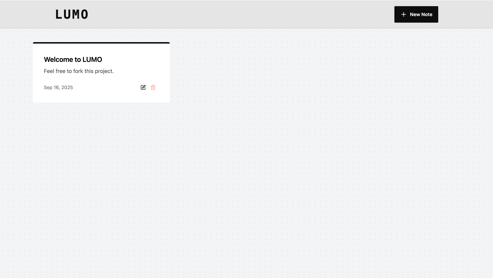

# 📝 LUMO 
MERN Stack Note Taking App ✨



---

## ✨ Highlights  

- 🧱 MERN Stack project (MongoDB, Express, React, Node.js)  
- 📝 Create, update, delete notes with title & description  
- ⚙️ REST API with rate limiting using Upstash Redis  
- 🚀 Fully responsive UI  
- 🌐 Concepts: HTTP methods, status codes, SQL vs NoSQL  
- 📦 Deployment - Render 


---

## 🔧 Commands  

### Backend  
```bash
cd backend
npm install
npm run dev
```
### Frontend
```bash
cd frontend
npm install
npm run dev
```
